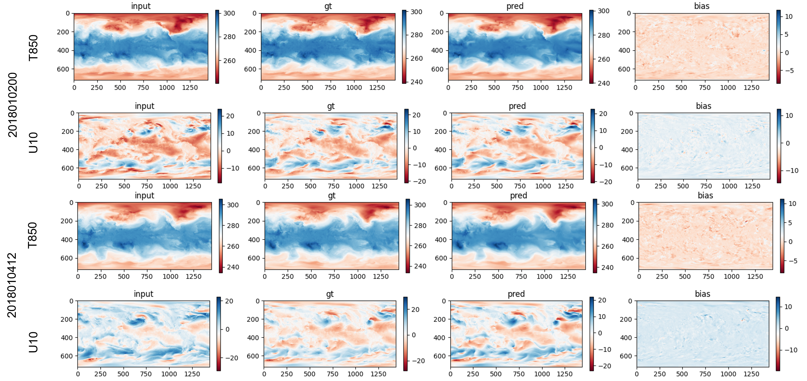
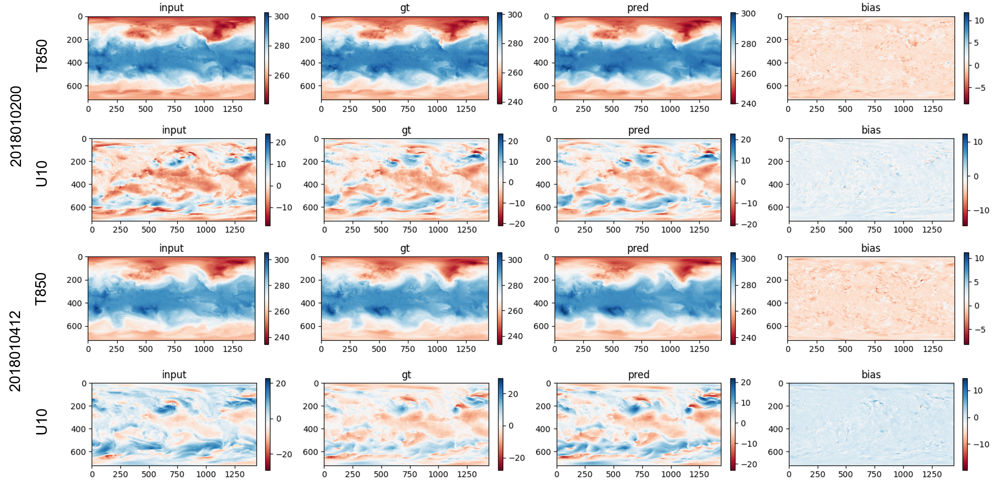
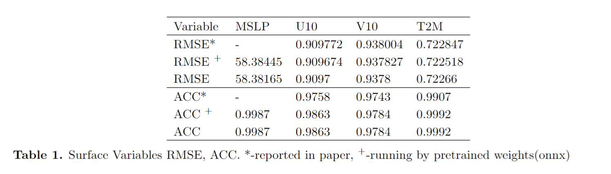
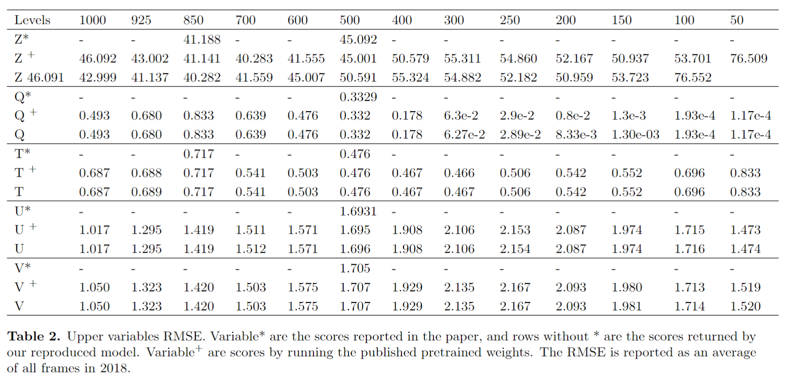

# pangu-pytorch

This represents our initial attempt to replicate the Pangu-Weather model as detailed in the work by Bi et al. (2023). Our implementation closely adheres to the pseudocode provided in the GitHub repository at https://github.com/198808xc/Pangu-Weather. We have made specific adjustments to certain components, such as the PatchEmbedding and PatchRecovery layers, in alignment with the pretrained weights available in ONNX files.

### Results
To assess the accuracy of our model, we conducted comparative tests focusing on the 24-hour horizon scores. These comparisons involve the scores reported in the original paper, the scores computed using the pretrained weights (in onnx file), and the scores generated by our reconstructed model. The tests were conducted on 2018 ERA5 data, specifically sampled at 00:00 UTC and 12:00 UTC.
#### Visual comparison
<p align="left">
  
</p>
Figure 1. Visualization of two sample results returned by the reproduced model.
<br/>
<br/>

<p align="left">
  
</p>
Figure 2. Visualization of two sample results returned by the pretrained weights
  
#### Quantitative comparison
<p align="center">
  
</p>
<p align="center">
  
</p>

### Data
The pretrined_model, aux_data, and sample surface/upper data is available in HuggingFace https://huggingface.co/datasets/zhaoshan/pangu_pytorch

### Structure

The downloaded files shall be organized as the following hierarchy:
```plain
Data -----------------------------------------------
data
├── pretrained_model
├── aux_data
├── surface
│   ├── surface_201501.nc
│   ├── surface_******.nc(YearMonth)
│   ├── surface_201912.nc
├── upper
│   ├── upper_20150101.nc
│   ├── upper_********.nc (YearMonthDay)
│   ├── upper_20191231.nc
Model ----------------------------------------------
├── pangu_torch
│   ├── era5_data
│   ├── finetune
│   ├── inference
│   │   ├── inference_singleOutput.py: to test the performance of *.onnx files, the output has only a single frame
│   │   ├── test_main.py: to test the performance of our rebuilt model
│   ├── models
│   ├── result
│   │   ├── '24': results returned by *24.onnx files
│   │   ├── 'reproduce': results returned by rebuilt torch models
```
### References
```code 
@article{bi2022pangu,
  title={Pangu-Weather: A 3D High-Resolution Model for Fast and Accurate Global Weather Forecast},
  author={Bi, Kaifeng and Xie, Lingxi and Zhang, Hengheng and Chen, Xin and Gu, Xiaotao and Tian, Qi},
  journal={arXiv preprint arXiv:2211.02556},
  year={2022}
}

@article{zhao2024efficient,
  title={Efficient Subseasonal Weather Forecast using Teleconnection-informed Transformers},
  author={Zhao, Shan and Xiong, Zhitong and Zhu, Xiao Xiang},
  journal={arXiv preprint arXiv:2401.17870},
  year={2024}
}
```


